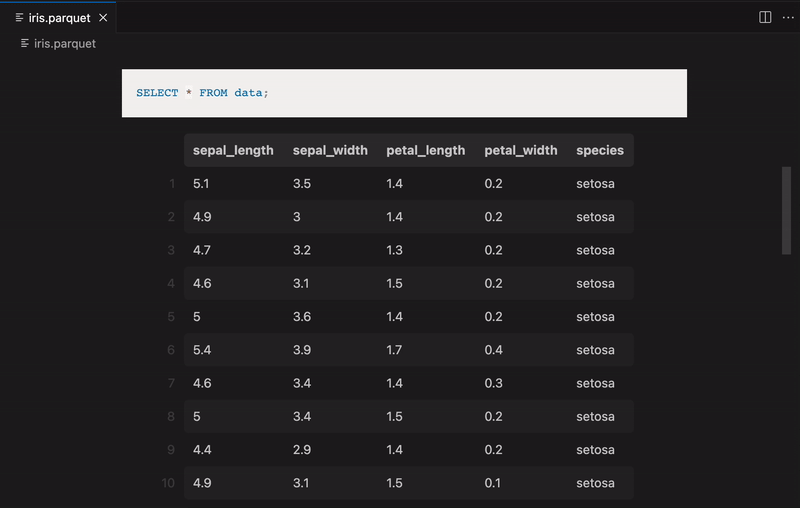

# Flat File Explorer

Explore Parquet and CSV files with DuckDB SQL (VSCode Extension)

## Introduction

Flat File Explorer is a VSCode extension that provides a preview of and SQL query
execution against Apache Parquet and CSV files. Under the hood, SQL queries are executed
by [DuckDB](https://duckdb.org/), which implements efficient partial reading and
parallel query processing.

## Quick Start

1. Install the [Flat File Explorer extension](https://marketplace.visualstudio.com/items?itemName=DeflateAwning.flat-file-explorer)
from the marketplace.

2. Open a Parquet (.parquet, .pq) file or CSV (.csv) and the extension will activate.
